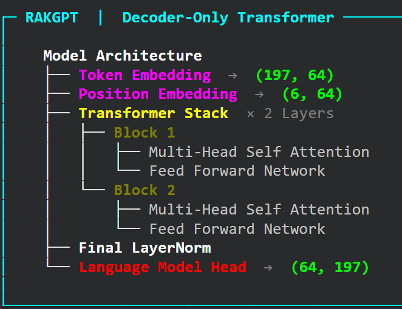
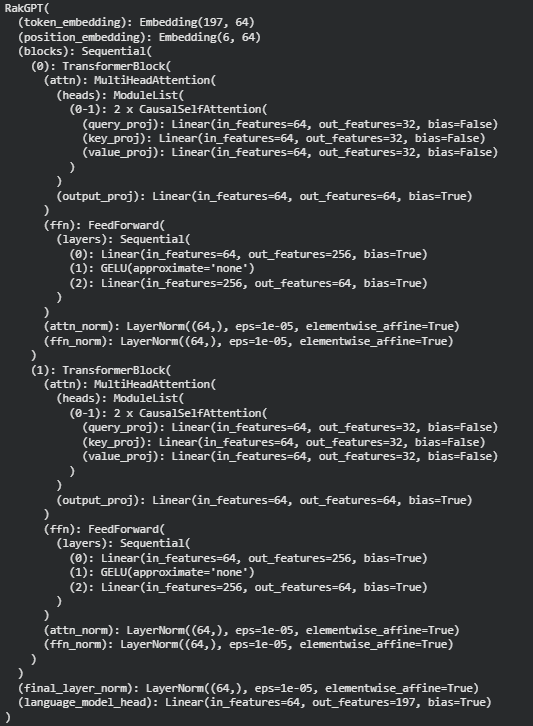

# RakGPT - Small Language Model
RakGPT is a minimal GPT-style decoder-only Transformer (Small Language Model) entirely from scratch in PyTorch.

The objective of this project was to deeply understand how autoregressive language models work internally — from token embeddings and positional encodings to masked self-attention, residual connections, and next-token prediction.

This implementation focuses on architectural clarity, controlled experimentation, and hands-on learning rather than scale.

---

## Demo: RakGPT Inference

  

## Full Inference Demo
[▶ Watch the full demo](assets/RakGPT-inference-c.mp4)

## Architecture Overview

RakGPT follows the standard decoder-only Transformer pipeline:

1. Token Embedding  
2. Positional Embedding  
3. Stacked Transformer Blocks  
   - Multi-Head Causal Self-Attention  
   - Feed Forward Network  
4. Final Layer Normalization  
5. Language Modeling Head  

The model is trained to predict the next token in an autoregressive manner using cross-entropy loss.

---

## Architecture Diagrams

### Overview Architecture

  

---

### Brief / Layer-Level Architecture

  

---

## Model Configuration

The model was trained with the following hyperparameters:
- context_len = 6
- embedding_dim = 64
- n_heads = 2
- n_layers = 2
- lr = 1e-3
- epochs = 1500
## RakGPT-Small-Language-Model

This configuration keeps the model compact while still demonstrating the full Transformer pipeline.

---

## Activation Function Experiment: ReLU vs GELU

An important experiment in this project was replacing the standard **ReLU** activation in the Feed Forward Network with **GELU**.

### Observations:

- GELU resulted in smoother training dynamics  
- Loss convergence appeared more stable  
- Generated text quality was noticeably improved  

This experiment highlights how small architectural choices can significantly influence model behavior.

---

## Key Learnings

Building RakGPT from scratch helped reinforce:

- How causal masking works in decoder-only models  
- The role of positional embeddings in sequence modeling  
- The importance of residual connections and layer normalization  
- The interaction between attention mechanisms and feed-forward layers  
- The impact of activation functions on training stability  

---

RakGPT is part of a continuous exploration into Transformer architectures, optimization behavior, and low-level implementation understanding.
